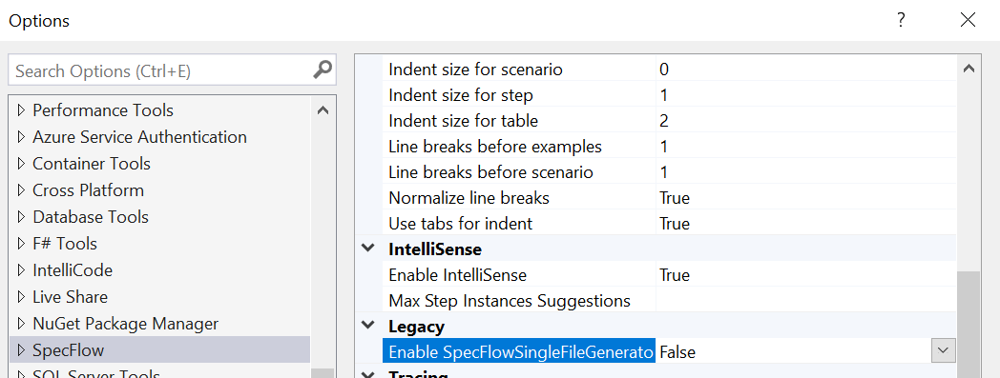

## Setting up your development environment

Before creating a new C# project and add SpecFlow feature files, it’s a good idea to install the SpecFlow Extension for Visual Studio. This Extension enables you to perform common SpecFlow actions from within your IDE, and it also provides syntax highlighting for more efficient writing of features files and scenarios.

Installing the extension from within Visual Studio can be done through the Extensions > Manage Extensions menu option (Visual Studio 2019) or through Tools > Extensions and Updates (earlier Visual Studio versions).

Switch to the Online section, do a search for ‘SpecFlow’ and install the ‘SpecFlow for Visual Studio’ extension.


If you’re using SpecFlow 3 (as we are going to do in this lab), you will also need to disable the SpecFlowSingleFileGenerator custom tool. This can be done through `Tools > Options > SpecFlow`. Locate the `Enable SpecFlowSingleFileGenerator CustomTool` option and set it to `False`.



## Creating a new project and adding required NuGet packages
To start writing SpecFlow features and add the underlying test automation, we first need to create a new project. In this example, I start with a project of the type ‘Class library (.NET Framework)’, because I am going to write code against the .NET Framework and I want to start with an empty project. The Class1.cs file that is auto-generated when you create this type of project can be removed as well.

After you created the project, add the following packages using the NuGet package manager:

* SpecFlow.NUnit – This installs both SpecFlow itself and the NUnit testing framework, which is the unit testing framework we’ll use in this example. Similar packages are available for other unit testing frameworks.
* NUnit3TestAdapter – This package allows us to run NUnit-based tests from within Visual Studio.
* SpecFlow.Tools.MsBuild.Generation – This package generates code that SpecFlow uses to run feature files (instead of the legacy SpecFlowSingleFileGenerator custom tool we disabled earlier).

Now that you have set up your IDE, created a new project and added the required packages, you’re ready to go and create your first SpecFlow feature.

## Creating and running a first SpecFlow feature
To do so, though, you first need an application to write tests for. In the remainder of this article and all follow-up articles, we’ll use Zippopotam.us, a REST API for looking up location data based on country code and zip code combinations (and vice versa, i.e., looking up zip codes for locations) for this.

Let’s take a quick look at how this API works. You can look up the location corresponding to the US zip code 90210 by sending a GET request to http://api.zippopotam.us/us/90210. The API will respond with a JSON document (as well as an HTTP status code and some header data) that tells us that this combination of country code and zip code corresponds to Beverly Hills in California:

```yaml
{
    "post code": "90210",
    "country": "United States",
    "country abbreviation": "US",
    "places": [
        {
            "place name": "Beverly Hills",
            "longitude": "-118.4065",
            "state": "California",
            "state abbreviation": "CA",
            "latitude": "34.0901"
        }
    ]
}
```