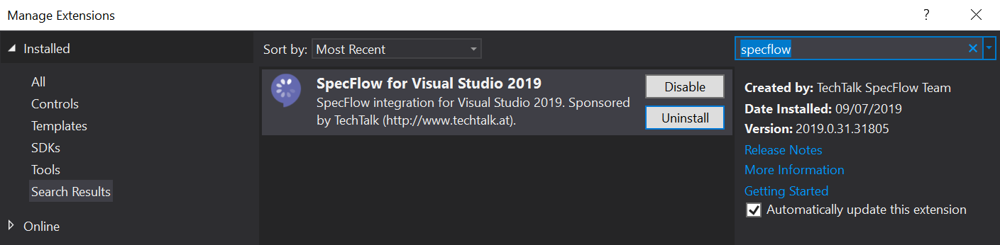

## Setting up your development environment

Before creating a new C# project and add SpecFlow feature files, it’s a good idea to install the SpecFlow Extension for Visual Studio. This Extension enables you to perform common SpecFlow actions from within your IDE, and it also provides syntax highlighting for more efficient writing of features files and scenarios.

Installing the extension from within Visual Studio can be done through the Extensions > Manage Extensions menu option (Visual Studio 2019) or through Tools > Extensions and Updates (earlier Visual Studio versions).

Switch to the Online section, do a search for ‘SpecFlow’ and install the ‘SpecFlow for Visual Studio’ extension.

