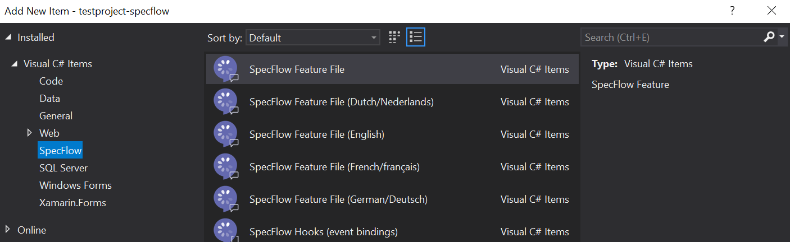

## Setting up your development environment

Before creating a new C# project and add SpecFlow feature files, it’s a good idea to install the SpecFlow Extension for Visual Studio. This Extension enables you to perform common SpecFlow actions from within your IDE, and it also provides syntax highlighting for more efficient writing of features files and scenarios.

Installing the extension from within Visual Studio can be done through the Extensions > Manage Extensions menu option (Visual Studio 2019) or through Tools > Extensions and Updates (earlier Visual Studio versions).

Switch to the Online section, do a search for ‘SpecFlow’ and install the ‘SpecFlow for Visual Studio’ extension.


If you’re using SpecFlow 3 (as we are going to do in this lab), you will also need to disable the SpecFlowSingleFileGenerator custom tool. This can be done through `Tools > Options > SpecFlow`. Locate the `Enable SpecFlowSingleFileGenerator CustomTool` option and set it to `False`.


## Creating a new project and adding required NuGet packages
To start writing SpecFlow features and add the underlying test automation, we first need to create a new project. In this example, I start with a project of the type ‘Class library (.NET Framework)’, because I am going to write code against the .NET Framework and I want to start with an empty project. The Class1.cs file that is auto-generated when you create this type of project can be removed as well.

After you created the project, add the following packages using the NuGet package manager:

* SpecFlow.NUnit – This installs both SpecFlow itself and the NUnit testing framework, which is the unit testing framework we’ll use in this example. Similar packages are available for other unit testing frameworks.
* NUnit3TestAdapter – This package allows us to run NUnit-based tests from within Visual Studio.
* SpecFlow.Tools.MsBuild.Generation – This package generates code that SpecFlow uses to run feature files (instead of the legacy SpecFlowSingleFileGenerator custom tool we disabled earlier).

Now that you have set up your IDE, created a new project and added the required packages, you’re ready to go and create your first SpecFlow feature.

## Creating and running a first SpecFlow feature
To do so, though, you first need an application to write tests for. In the remainder of this article and all follow-up articles, we’ll use Zippopotam.us, a REST API for looking up location data based on country code and zip code combinations (and vice versa, i.e., looking up zip codes for locations) for this.

Let’s take a quick look at how this API works. You can look up the location corresponding to the US zip code 90210 by sending a GET request to http://api.zippopotam.us/us/90210. The API will respond with a JSON document (as well as an HTTP status code and some header data) that tells us that this combination of country code and zip code corresponds to Beverly Hills in California:

```yaml
{
    "post code": "90210",
    "country": "United States",
    "country abbreviation": "US",
    "places": [
        {
            "place name": "Beverly Hills",
            "longitude": "-118.4065",
            "state": "California",
            "state abbreviation": "CA",
            "latitude": "34.0901"
        }
    ]
}
```

Now, back to writing our first SpecFlow feature and using it to create an automated acceptance test. A SpecFlow feature is a file with a .feature file extension, describing the intended behaviour of a specific component or feature of the application you are going to write tests for. An example of a feature for our API would be the ability to return the correct location data based on a country code and zip code, or on a more granular level, supporting the ability to return more than one location for a specific country and zip code (this is very useful for use in the UK and Germany, among other countries).

Feature files contain one or more scenarios that describe the specifics of the behaviour for that feature, often expressed in very concrete examples. These examples are often obtained through following a process known as `Specification by Example`. The process of creating good feature files and scenarios, and techniques on how to improve your skills in this area, are outside the scope of this article.

Here’s an example feature file and three scenarios that describe one of the core features of our API through some examples:

```yaml
Feature: Returning location data based on country and zip code
  As a consumer of the Zippopotam.us API
  I want to receive location data matching the country code and zip code I supply
  So I can use this data to auto-complete forms on my web site

  Scenario: An existing country and zip code yields the correct place name
    Given the country code us and zip code 90210
    When I request the locations corresponding to these codes
    Then the response contains the place name Beverly Hills

 Scenario: An existing country and zip code yields the right number of results
   Given the country code us and zip code 90210
   When I request the locations corresponding to these codes
   Then the response contains exactly 1 location

  Scenario: An existing country and zip code yields the right HTTP status code
    Given the country code us and zip code 90210
    When I request the locations corresponding to these codes
    Then the response has status code 200
```

We can add a new feature file to our project by right-clicking the project name and selecting `Add > New Item`. Since we have installed the SpecFlow extension before, we can now select `SpecFlow > SpecFlow Feature File` to add a new feature file to our project:



After the feature file has been added to the project, we can edit the specifications in there to reflect the expected behaviour we defined earlier for our zip code API:


The fact that the steps in our scenarios are shown in purple means that there are no step definition methods associated with the steps in the scenarios yet.

You can run the scenarios in this feature and see what happens by:

1. Opening the Test Explorer Window using the menu option Test > Windows > Test Explorer.
2. Building the project, for example using Ctrl + Shift + B to build all projects in the current solution – this should result in several tests becoming visible in the Test Explorer.
3. Right-clicking the tests you would like to run and choosing Run Selected Tests.
Since there is no code to execute, SpecFlow will display an error message:


Fortunately, SpecFlow offers an easy way to generate these step definitions methods for you. Right-click anywhere in the feature file editor window and select `Generate Step Definitions`, another useful feature that comes with the SpecFlow Visual Studio extension.


This will display a window where you can select the steps for which to generate step definition methods, as well as the step definition style. You will read more about the different styles in the next article, for now we are going to stick with the default Regular expressions in attributes option. Click Generate, select the destination for the step definition file and click Save.

A C# .cs file with the generated step definition methods will now be added to your project. Here’s a snippet from that file:

```csharp
using System;
using TechTalk.SpecFlow;

namespace testproject_specflow.StepDefinitions
{
    [Binding]
    public class ReturningLocationDataBasedOnCountryAndZipCodeSteps
    {
        [Given(@"the country code us and zip code (.*)")]
        public void GivenTheCountryCodeUsAndZipCode(int p0)
        {
            ScenarioContext.Current.Pending();
        }

        [When(@"I request the locations corresponding to these codes")]
        public void WhenIRequestTheLocationsCorrespondingToTheseCodes()
        {
            ScenarioContext.Current.Pending();
        }

        [Then(@"the response contains the place name Beverly Hills")]
        public void ThenTheResponseContainsThePlaceNameBeverlyHills()
        {
            ScenarioContext.Current.Pending();
        }
```