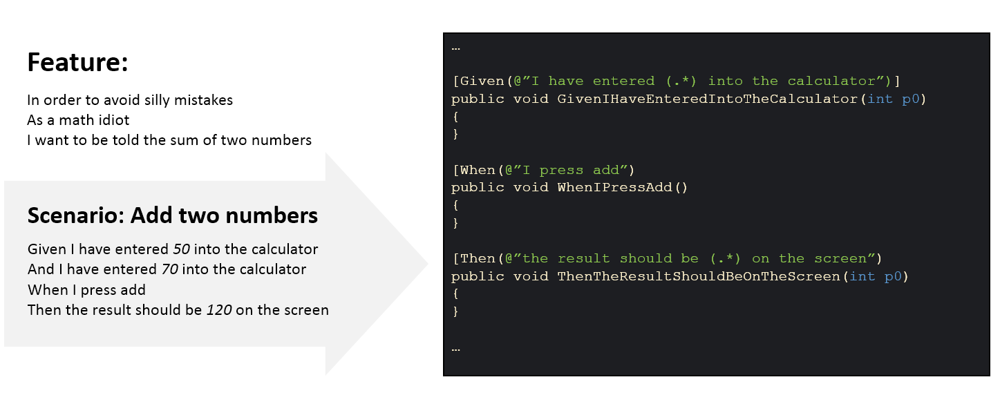
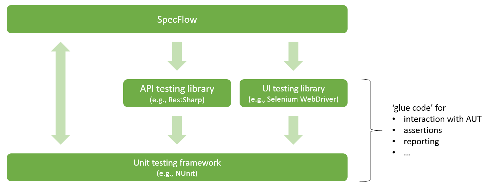

# BDD, SpecFlow and The SpecFlow Ecosystem

## What is Behaviour Driven Development (BDD)?
Introduced by Dan North in 2006, Behaviour Driven Development is an Agile software development practice that encourages collaboration between developers, testers and business representatives, such as business analysts or product owners.

One of the main goals of BDD is to create a shared understanding of how an application should behave by facilitating discussion and coming up with concrete examples, expressed in a Domain Specific Language (DSL) using the Given / When / Then syntax known as Gherkin. The other component of BDD is concerned with turning these specifications into automated acceptance tests, and that is where tools like SpecFlow come into play.

This means that there is a difference between using tools like SpecFlow on the one hand and adopting BDD as a process on the other hand. Having done the former (i.e., SpecFlow is part of your test automation stack) does not equal practicing BDD. Now, I don’t mean to say that there’s no value in using these tools when you have not adopted the other aspects of BDD, but it’s a good idea to make it clear what aspect(s) of BDD we are talking about here.

## What is SpecFlow and How Does it Support BDD?
Instead, we should say that SpecFlow supports BDD, and it does so by providing a mechanism to turn your specifications into executable code, which can then be used to create automated tests that can be run against the application to verify whether it actually exerts the behavior as has been described in these specifications.

To put it in BDD and SpecFlow terms, SpecFlow turns specifications that are written down in the Gherkin Given / When / Then syntax as scenarios contained in feature files into executable code methods known as step definitions.

Having transformed these steps, expressed in natural, readable language, into executable code, that’s where the responsibility of SpecFlow ends. To further implement your test automation so that it actually communicates with your application under test, you will need to add other tools to your test automation solution.

Some tools that are often used in combination with SpecFlow to form a test automation framework are:

* A unit testing framework such as NUnit, MSTest or xUnit.NET. This unit testing framework typically performs three tasks:
  - Act as a test runner that executes the scenarios one by one, or in parallel.
  - Provide an assertion library that can be used to compare expected outcomes that are codified by the creator of the test automation with actual outcomes observed in the application under test.
  - Provide basic test results in reports, mostly in a form that can be picked up by a test orchestration or Continuous Integration tool like Jenkins, GitLab, Bamboo or similar.
* A library that interacts with browsers and browser applications. The most common example of these tools is the Selenium WebDriver library.
* A library that interacts with APIs or web services, for example RestSharp.
* A library that generates human-readable reports, often in HTML format. Two popular examples of this category of tools are Allure and ExtentReports.

